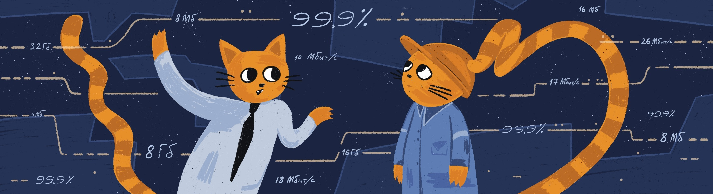

# Non-functional requirements 

Summary:
In the current project, you will review non-functional requirements. You will understand how the success of the system depends on them. You will learn to identify and formulate them.

💡 [Tap here](https://new.oprosso.net/p/4cb31ec3f47a4596bc758ea1861fb624) **to leave your feedback on the project**. It's anonymous and will help our team make your educational experience better. We recommend completing the survey immediately after the project.

## Contents

  - [Chapter I](#chapter-i)
    - [Preamble](#preamble)
    - [Literature](#literature)
  - [Chapter II](#chapter-ii)
    - [General Rules](#general-rules)
  - [Chapter III](#chapter-iii)
    - [Theory](#theory)
  - [Chapter IV](#chapter-iv)
    - [Description of tasks](#description-of-tasks)
    - [Task 1. Haircut Appointment](#task-1-haircut-appointment)
    - [Task 2. Delivery of Orders](#task-2-delivery-of-orders)
  - [Chapter V](#chapter-v)
    - [Exercise 00 — Identification of Non-Functional Requirements](#exercise-00--identification-of-non-functional-requirements)
    - [Exercise 01 — Classification of Non-Functional Requirements](#exercise-01--classification-of-non-functional-requirements)
    - [Exercise 02 — Selection of NFRs](#exercise-02--selection-of-nfrs)
    - [Exercise 03 — Performance Attributes](#exercise-03--performance-attributes)
    - [Exercise 04 — Availability and Reliability Attributes](#exercise-04--availability-and-reliability-attributes)
    - [Exercise 05 — Scalability Attributes](#exercise-05--scalability-attributes)
    - [Exercise 06 — Security Attributes](#exercise-06--security-attributes)

## Chapter I 

### Preamble 
The success of a system depends not only on whether it performs the functions that customers and system users need. How it performs them is also important:

- How often the system is unavailable during users' working hours;
- Whether users are satisfied with the speed of certain operations;
- Whether users find it convenient to work in the system;
- Whether data is stored in the system for as long as needed;
- Whether the network capacity is adequate for the amount of data being sent.

This is not an exhaustive list of conditions (they are different for each system) that determine the quality of a system's functioning.

In this project, you will focus on these conditions. and learn to identify and formulate them.

### Literature

1. Karl Wiegers, Joy Beatty, "Software Requirements" 3rd edition, amplified. 
2. N. Tarasova "Non-functional requirements. How not to lose the quality of the product" https://rutube.ru/video/9f0c8e681994034e5eeb05a9b3e23c69/?ysclid=m0m8oih8dv400187997
3. M. Maximov "Non-functional requirements. How an analyst should work with them" https://rutube.ru/video/523fb99f096855893c40dbe6918bca7d/?ysclid=m0m8pcd64k889258712
4. I.Gertovskaya "To avoid falling into a trap. On the influence of non-functional requirements on system performance" https://rutube.ru/video/20792726635aeea4f0ae6f7ff4970d70/?ysclid=m0m8prjjfn9750426 .

## Chapter II 

### General Rules 
1. Along the way, you may feel a sense of uncertainty and a severe lack of information: that's OK. Remember, the information in the repository and on Google is always with you. So are your peers and Rocket.Chat. Communicate. Search. Use common sense. Don't be afraid to make mistakes.
2. Pay attention to sources of information. Check. Think. Analyse. Compare. 
3. Look at the text of each assignment. Read it several times. 
4. Read the examples carefully. There may be something in them that is not explicitly stated in the task itself.
5. You may find inconsistencies where something new in the terms of the task or examples conflicts with something you already know. If you come across such an inconsistency, try to work it out. If not, write it down as an open question and find out as you work. Do not leave open questions unanswered. 
6. If a task seems confusing or impossible, it only seems that way. Try to break it down. It is likely that some parts will become clear. 
7. There will be several tasks. Those marked with an asterisk (\*) are for the more meticulous students. These tasks are more difficult and are not compulsory. But doing them will give you extra experience and knowledge.
8. Don't try to fool the system or the people around you. You will fool yourself first.
9. Got a question? Ask your neighbour to the right. If that doesn't help, ask your neighbour on the left.
10. When you use help, you should always understand why and how. Otherwise the help is useless.
11. Always push only to the develop branch! The master branch will be ignored. Work in the src directory.
12. There should be no files in your directory other than those specified in the tasks.

## Chapter III 

### Theory 
What does the successful execution of operations in the system depend on? 

1. On the number of simultaneously executed operations of the same type in the system. In fact — on the number of users of the same role (performing the same type of operations) working simultaneously in the system. 
2. The technology (equipment) on which the software is installed. 
3. On the performance of networks providing interaction with related systems, including the stability and capacity of the Internet, if the interaction is via the Internet. 
4. The methods, settings and quality of code that ensure the speed and reliability of operations in the system.
5. The architecture of the system. What system software the application software runs on, what technologies are used.

There is no single architectural solution for all cases. Some systems require the accumulation and processing of large amounts of data over several years (e.g., weather forecasting), while others require the receipt of small messages and a quick response to each message (e.g., banking transactions). 

The architect is responsible for building the system architecture, but this is done based on the information that the analyst first gathered.

The indicators that influence the success of the functions in the system have historically been called non-functional requirements, as opposed to functional requirements. These indicators are also called quality attributes. Depending on the goals and functions of the system, certain attributes are more or less important. Here is a list of the most commonly used attributes.

| Run time     | Design time     |
| ------------ | --------------- |
| Availability | Repeatability   |
| Reliability  | extensibility   |
| Durability   | Portability     |
| Scalability  | Compatibility   |
| Usability    | Maintainability |
| Security     | Localization    |
| Performance  | Testability     |
| Constraints  |                 |

This is not an exhaustive list of quality attributes, and not all of the attributes listed below are required in every project. 

An explanation of the concepts behind each attribute, examples of quality attributes, and how to identify them can be found in:

1) Karl Wiegers, Joy Beatty, "Software Requirements" 3rd edition, chapter 14. 
2) [N. Tarasova "Non-functional requirements. How not to lose the quality of the product"](https://www.youtube.com/watch?v=IEWlrZcqXCw).
3) [M. Maximov "Non-functional requirements. How an analyst should work with them»](https://www.youtube.com/watch?v=dJKr6DfY3Cs&t=2375s).
4) [I.Gertovskaya "To avoid falling into a trap. On the influence of non-functional requirements on system performance"](https://www.youtube.com/watch?v=x--UgY-QbVA).

The presentation by Nadezhda Tarasova and Irina Gertovskaya describes the categories of non-functional requirements, sources of NFRs, and how to identify them. When identifying non-functional requirements, analysts should work closely with other roles in the team and with customer representatives. M. Maximov's presentation gives a good overview of who to interact with for what quality attributes. We recommend listening not only to the presentations, but also to the questions and answers. This will help you to complete the tasks.

It is also important to understand that certain attributes may be more or less important depending on the functionality of the system, the goals of the customer, and the needs of the system users. Thus, a system intended for online sales to a wide audience should have a comfortable, attractive interface, taking into account design trends (otherwise users will go to an online store with more convenient access), quick access to client functions, but there is no point in it to store the state of offered goods for several years. And the system for internal use in a large factory, for example, is designed for a much smaller contingent of users, the design does not need to take into account trends, it is important to have convenient access to operations, but to analyze data from several previous years is required. The approach to determining the importance of non-functional requirements is well described in Chapter 14 of Karl Wiegers' book.

All of this needs to be considered when identifying and forming non-functional requirements. 

## Chapter IV 

### Description of tasks

### Task 1. Haircut Appointment 

The management of a chain of barbershops decided to implement an online booking system. The main objective is to develop the business by expanding the customer base through the possibility of online registration, as well as to reduce employee labour costs and manual labour by automatically informing customers through communication channels. 

Both registered and unregistered visitors can book an appointment on the website. When making an appointment, they can select the type of service: hairdressing or cosmetology, as well as the service itself, the master and the time from the available intervals. The system should provide automatic sending of reminders to clients through the communication channel chosen by the client (Telegram, WhatsApp, VK, SMS) according to the schedule set by the manager. After receiving a service, the system offers the client to evaluate the service and write suggestions on how to improve the work.

The schedule of masters and the services provided by each master should be entered by the manager, who may be more than one person. This person is also responsible for keeping the schedule up to date and adjusting it if necessary, communicating with customers manually, marking the service, charging and accepting payment, sending the payment data to the accounting department. The manager can also receive reports on completed services and view customer feedback.

Each master has the ability to view the schedule and appointments for their services, as well as customer reviews.

The first stage of the system implementation is to identify 5% of the network outlets with 75 masters. In standard mode, masters are loaded at 60-70%, and in peak periods (before New Year and other holidays) the demand increases to 150% and more. If the implementation is successful in the first quarter of operation, the system will be extended to the entire network in all regions of the Russian Federation in the next nine months.

### Task 2. Delivery of Orders 

During the lockdown, many grocery stores and food companies dramatically increased their online sales and the need for quick delivery of small quantities to individual customers increased. 

A group of students got together and decided to create a delivery service startup. The idea is to quickly receive information about orders, pickup location and time, delivery location, desired delivery dates, and distribute this information to couriers who will pick up the order at the pickup location and deliver it to the delivery location. They decided to develop an online system where orders could be collected and quickly sorted for delivery by couriers.

The first step was to collect orders from stores and caterers in any way possible and have the operator enter them into the system in a consistent format, as well as developing a mobile application for the courier. The courier should be able to view order information, select an order from those available, book it, pick it up at the collection point and deliver it to the customer. The result of the courier's actions should be immediately reflected in the system via a mobile application. The system should also include a dispatcher who controls the couriers and reassigns orders if necessary. Information on received orders should be sent to the accounting department (to another IT system) to calculate delivery charges with order suppliers. Order delivery information should also be sent to the accounting department to calculate payment to couriers. Accrued payment should be transferred to the system and displayed in the courier's personal account. And there should also be an administrator's workstation, where couriers are registered and access rights are assigned to all of them.

## Chapter V 

### Exercise 00 — Identification of Non-Functional Requirements 

List the numbers of sentences that contain non-functional requirements.

1. The system must generate a list of available slots. 
2. The system must generate a list of free slots in no more than 10 seconds with 1000 users working simultaneously.
3. The system must provide access to functions according to the user's assigned role.
4. The system must provide access to the data of the management area of responsibility, only to management employees and controllers.
5. The system must retain information on orders completed by the courier for at least 3 years.  
6. The system must calculate the payment to the courier for the delivery of the order.
7. The system must calculate end-of-day balances on client accounts no later than 50 minutes after the end of the operational day if the number of client accounts does not exceed 1000000.  
8. System recovery in case of failure must be performed in no more than 30 minutes.
9. The system must restore the previously entered data. It is allowed to lose data no more than 5 minutes before the failure. 

**Scale from 1 to 5**

### Exercise 01 — Classification Non-Functional Requirements 
Match the non-functional requirements and types of NFRs from the following.

1. For each NFR, indicate the type of NFR. 
2. Enter the results in a table.

Types of NFRs:

1) Availability,
2) Reliability,
3) Scalability,
4) Localization,
5) Usability,
6) Performance,
7) Compatibility,
8) Durability,
9) Security.

NFR:

1) The system must provide the user with the "Administrator" role with access to assign and correct user roles. 
2) The system must keep information about client's payments for goods for at least 5 years.
3) The system must prohibit access to assigning and correcting user roles for all users except for users with the "Administrator" role.
4) The system recovery time after a failure should not exceed 30 minutes.  
5) After the client selects a region, the system should display the regional time and provide the client with the ability to perform its actions taking into account the regional time.
6) The system must provide the client with the opportunity to place an order 24 hours a day, seven days a week, except for the time of technological breaks. Time of technological break: weekly, Sunday from 2:00 to 4:00.
7) The first wave of the system implementation should be carried out in two regions. Within six months after the completion of the first wave of implementation, the system shall be implemented in the next four regions.
8) The screen interfaces for the clients of the system shall meet the current trends and provide color customization.
9) The system should be available 99% of the time from 9:00 to 21:00, the rest of the time — 90%.
10) The system must provide the selection of a master and service in an average of 3 seconds and no more than 6 seconds after a request for simultaneous work of up to 1000 users.
11) The system must support user interface through browsers: Chrome, Safari, Firefox. And tested on the following versions of browsers: specify the last and second-to-last version of browsers.

**Scale from 1 to 5**

### Exercise 02 — Selection of NFRs 
Select the types of NFRs for Task 1 and Task 2.

1. Specify a list of NFR types required for successful system operation. 
2. Specify at least 7 types of NFRs in the list.
3. Specify the priority of each NFR type (from 1 to 5, with 1 being the highest priority) separately for each task. 

**Scale from 1 to 5**

### Exercise 03 — Performance Attributes 
Specify the performance attributes for Task 1 and Task 2.

1. For each task, identify at least 3 important scenarios from a business and customer perspective. 
2. Identify the roles involved in each scenario.
3. For each scenario, identify:
   1. Approximate number of logged on users by role; 
   2. Approximate number of concurrent users by role;
   3. peak hours of user work;
   4. Approximate number of concurrent users by role during peak periods.
4. Identify 3 to 5 operations/pages that require controlled response time (most important for efficient system operation).
5. Specify the response time for each of the monitored operations.
6. Provide results in tabular form, multiple tables are acceptable.

**Scale from 1 to 5**

### Exercise 04 — Availability and Reliability Attributes 
Specify the availability and reliability attributes for Task 1 and Task 2.

1. Specify the availability attributes for each task. 
2. Specify the reliability attributes for each task.

**Scale from 1 to 5**

### Exercise 05 — Scalability Attributes 
Specify scalability and localization attributes for Task 1 and Task 2.

1. Specify the need for or lack of system scalability. 
2. If there is a need for scaling, describe the scaling requirements.
3. Specify the need or lack of localization.
4. If there is a need for localization, describe the localization attributes.  

**Scale from 1 to 5**

### Exercise 06 — Security Attributes 
Describe the password and logging security requirements for Task 1 and Task 2.

Specify password and multifactor requirements using different approaches in each Task. 

1. Specify password composition requirements. 
2. Describe password reset, change, and recovery rules.
3. Specify multifactor authentication requirements:
   1. actions that require multifactor authentication,
   2. the order of authentication
4. Specify logging requirements:
   1. actions requiring logging,
   2. logged data.

**Scale from 1 to 5**
