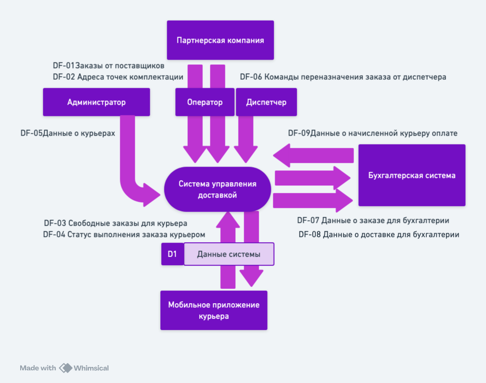
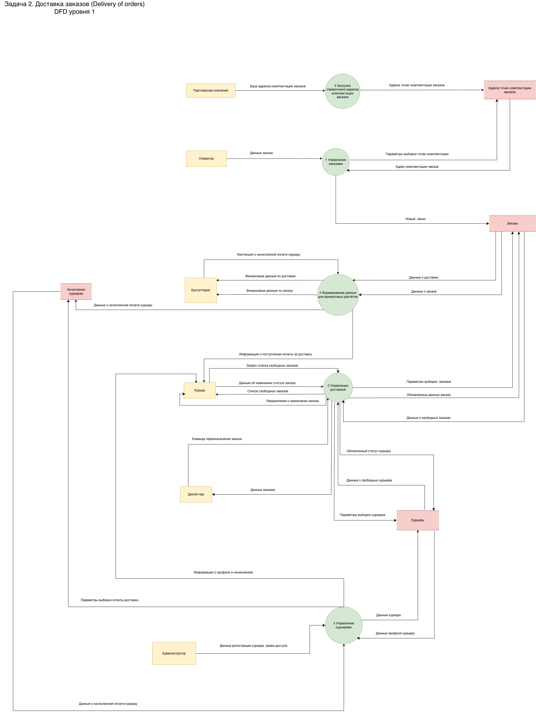

<small>

# Exercise 00 — Выделение потоков данных

Этот проект групповой, так что ты будешь выполнять его в команде. 

Для задачи 2 выявите не менее 6 потоков данных. 

1. Выпишите потоки данных, требующиеся для нашей системы:
   1. название потока данных;
   2. назначение (цель) потока данных;
   3. направление потока данных (в систему или вне ее).
2. Представьте в табличном виде.

## Задача 2. Доставка заказов (Delivery of orders)

В локдаун многие продуктовые магазины и предприятия питания резко увеличили объемы онлайн-продаж, и возросла потребность в быстрой доставке мелких партий товаров индивидуальным клиентам. 

Компания студентов собрались и решила создать стартап службы доставки. 

Идея состоит в том, чтобы оперативно получать информацию о заказах, месте и сроке комплектации, месте доставки, желаемых сроках доставки и раздавать инфо курьерам, которые будут получать заказ в месте комплектации и доставлять в место доставки. Решили развернуть онлайн-систему, куда **стекаются заказы** и откуда **курьеры оперативно разбирают заказы для выполнения**. На первом этапе решили собирать заказы от магазинов и предприятий питания любым доступным способом и вводить в систему в едином формате силами оператора. **Первый раз базу адресов комплектации заказов получили от партнерской компании и решили загрузить единственный раз.** Но разработать мобильное приложение для курьеров. 

Курьер должен иметь возможность просматривать информацию о заказах, выбирать заказ из свободных, бронировать его, забирать в точке выдачи и доставлять  клиенту. Результат своих действий **курьер должен оперативно отражать в системе через мобильное приложение**. Также в системе должен работать диспетчер, который контролирует курьеров и при необходимости переназначает заказы. Информация о **поступивших заказах должна направляться в бухгалтерию (в другую ИТ-систему)** для расчета с поставщиками заказов за доставку. Также в бухгалтерию должна направляться **информация о доставке заказа,** где будет производиться расчет оплаты курьеров. **Начисленная оплата должна передаваться в систему** и отражаться в личном кабинете курьера. И еще запланировано рабочее место администратора, регистрирующего курьеров и назначающего всем права доступа.

# Выделение потоков данных

| ID    | Название потока данных                      | Назначение (цель)                                                                | Направление                                  |
|-------|-------------------------------------------- |--------------------------------------------------------------------------------- |----------------------------------------------|
| DF-01 | Заказы от поставщиков                       | Передача информации о новых заказах в систему для дальнейшей обработки           | В систему (поставщик → оператор → система)                                      |
| DF-02 | Адреса точек комплектации                   | Загрузка справочника точек комплектации для дальнейшей привязки к заказам        | В систему (от партнерской компании)  |
| DF-03 | Свободные заказы для курьера                | Предоставление списка доступных для бронирования заказов курьерам                | Из системы (в мобильное приложение курьера)                                      |
| DF-04 | Статус выполнения заказа курьером           | Фиксация этапов выполнения заказа (забронирован, выдан, в пути, доставлен)       | В систему (из мобильного приложения курьера)                                      |
| DF-05 | Данные о курьерах                           | Регистрация курьеров и назначение прав доступа для работы с системой             | В систему (из интерфейса администратора)                               |
| DF-06 | Команды переназначения заказа от диспетчера | Перераспределение заказа между курьерами в случае необходимости                  | В систему (из интерфейса диспетчера) | 
| DF-07 | Данные о заказе для бухгалтерии             | Передача данных о поступившем заказе для расчета оплаты поставщикам              | Из системы (в стороннюю IT-систему бухгалтерии)                                  |    
| DF-08 | Данные о доставке для бухгалтерии           | Передача данных о выполненных доставках для начисление оплаты курьеру            | Из системы (в стороннюю IT-систему бухгалтерии)                                  |
| DF-09 | Данные о начисленной курьеру оплате         | Передача информации о начислениях за доставки в личный кабинет курьера           | В систему (из сторонней IT-системы бухгалтерии)                                  |

